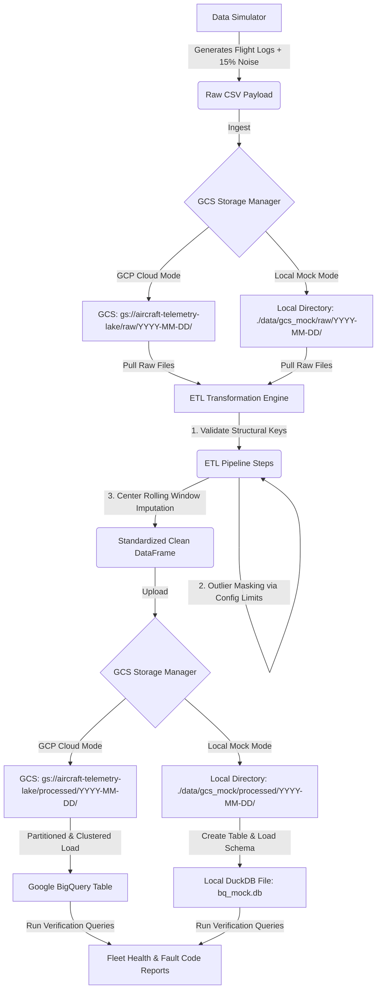

# Cloud-Native Aircraft Fleet Reliability Data Lake (GCP & Python)

This production-grade data engineering pipeline simulates, cleans, stores, and analyzes high-volume aircraft sensor telemetry data to monitor real-time fleet health. Designed to run seamlessly in either **GCP Cloud Mode** (using Google Cloud Storage and BigQuery) or an **Offline Local Mock Mode** (using DuckDB and local files), it demonstrates robust ETL patterns, time-series data imputation, and cost-optimized data warehousing.

---

## 📌 Problem Statement

In modern aviation operations, modern commercial aircraft continuously emit vast streams of sensor telemetry (engine temperatures, altitudes, fuel consumption rates, and system vibrations) during flights. Real-time processing and analysis of this data are essential for **predictive maintenance** and **active fleet reliability monitoring** to prevent mechanical failures and optimize flight paths.

However, real-world telematics streams are highly noisy and prone to data corruption:
1. **Network Packet Loss & Latency:** Ingested streams often arrive with missing structural keys (e.g., missing timestamps or empty aircraft identifiers).
2. **Sensor Degradation & Hardware Malfunctions:** Faulty physical sensors output extreme, impossible outliers (e.g., negative altitudes or engine temperatures exceeding physical maximums).
3. **Data Gaps:** Short dropouts in transmission leave gaps of missing values (NaNs) across critical variables.

To address this, airlines require a data platform that can:
- Ingest high-volume raw telemetry securely.
- Perform robust cleaning, validating physical boundaries without throwing away entire rows of records when only one sensor fails.
- Reconstruct missing data points using localized time-series aggregation.
- Organize clean records in a data warehouse optimized for query performance and cost-efficiency.

---

## 💡 The Solution

This project implements a cloud-native, end-to-end data lake and warehouse architecture designed to process raw telemetry logs reliably:

1. **Simulation Engine (`simulator.py`):**
   - Generates flight logs for a fleet of **500 aircraft** running over a configurable time window.
   - Injects an **exact 15% noise rate** (structural nulls, sensor NaNs, boundary outliers, and mechanical fault codes) to benchmark cleaning algorithms.

2. **Ingestion & Raw Zone Partitioning (`storage.py`):**
   - Programmatically provisions cloud storage resources.
   - Writes raw data into a Hive-partitioned directory format matching the virtual flight day (`gs://aircraft-telemetry-lake/raw/YYYY-MM-DD/`).

3. **Robust ETL Transformation Engine (`etl.py`):**
   - **Structural Integrity:** Discards rows missing primary identifiers (`timestamp`, `aircraft_id`) and standardizes timestamps to ISO 8601 UTC.
   - **Anomaly Masking:** Uses engineering boundaries to flag physical outliers (e.g., engine temperature $> 1200^\circ\text{C}$ or vibration levels $> 10$) and replaces them with NaNs.
   - **Local Imputation:** Grouped by individual aircraft, a **centered rolling window average** (size 5) imputes missing sensor telemetry. Remaining edge gaps are resolved using forward/backward fills, with a global mean as a last-resort fallback.

4. **Data Warehouse Optimization (`warehouse.py`):**
   - Automatically initializes datasets and schema tables.
   - Optimizes BigQuery tables through **Time-Unit Partitioning** (daily by `timestamp` column) to minimize query scan costs.
   - Employs **Clustering** on `aircraft_id` and `aircraft_model` to accelerate fleet aggregations and speed up analytical queries.

5. **Local Mock Mode (Offline Development):**
   - Enables development and testing without GCP access.
   - Simulates GCS locally in `./data/gcs_mock/` and replaces Google BigQuery with **DuckDB** to execute analytical SQL logic on local disk.

---

## 📐 Architecture & Data Flow



---

## 📁 Repository Structure

*   [config.py](file:///Users/vkdushyanthreddy/Documents/PERSONAL/resume%20projects/Cloud-Native%20Aircraft%20Fleet%20Reliability%20Data%20Lake%20%28GCP,%20Python%29lder/config.py) - Contains project configurations, physical sensor limits, and GCS/BigQuery environment variables.
*   [simulator.py](file:///Users/vkdushyanthreddy/Documents/PERSONAL/resume%20projects/Cloud-Native%20Aircraft%20Fleet%20Reliability%20Data%20Lake%20%28GCP,%20Python%29lder/simulator.py) - Simulates the aircraft fleet telemetry and injects realistic data corruptions.
*   [storage.py](file:///Users/vkdushyanthreddy/Documents/PERSONAL/resume%20projects/Cloud-Native%20Aircraft%20Fleet%20Reliability%20Data%20Lake%20%28GCP,%20Python%29lder/storage.py) - Orchestrates GCS file upload/download and local storage mocking.
*   [etl.py](file:///Users/vkdushyanthreddy/Documents/PERSONAL/resume%20projects/Cloud-Native%20Aircraft%20Fleet%20Reliability%20Data%20Lake%20%28GCP,%20Python%29lder/etl.py) - Implements the core cleaning logic, outlier detection, and time-series imputation.
*   [warehouse.py](file:///Users/vkdushyanthreddy/Documents/PERSONAL/resume%20projects/Cloud-Native%20Aircraft%20Fleet%20Reliability%20Data%20Lake%20%28GCP,%20Python%29lder/warehouse.py) - Sets up partitioned schemas and loads datasets into BigQuery or DuckDB.
*   [main.py](file:///Users/vkdushyanthreddy/Documents/PERSONAL/resume%20projects/Cloud-Native%20Aircraft%20Fleet%20Reliability%20Data%20Lake%20%28GCP,%20Python%29lder/main.py) - Orchestrator script to run the full pipeline end-to-end.
*   [verify_pipeline.py](file:///Users/vkdushyanthreddy/Documents/PERSONAL/resume%20projects/Cloud-Native%20Aircraft%20Fleet%20Reliability%20Data%20Lake%20%28GCP,%20Python%29lder/verify_pipeline.py) - Comprehensive unit test suite checking simulator corruption rates, ETL assertions, and database loads.
*   [requirements.txt](file:///Users/vkdushyanthreddy/Documents/PERSONAL/resume%20projects/Cloud-Native%20Aircraft%20Fleet%20Reliability%20Data%20Lake%20%28GCP,%20Python%29lder/requirements.txt) - List of Python dependencies (pandas, numpy, duckdb, google-cloud-bigquery, etc.).

---

## ⚙️ Getting Started & Execution

### 1. Prerequisites
- Python 3.9 or higher
- [Google Cloud SDK](https://cloud.google.com/sdk) installed (only if running in GCP Cloud mode)

### 2. Installation
Clone the repository and set up a clean Python virtual environment:

```bash
# Activate virtual environment
python3 -m venv venv
source venv/bin/activate

# Install dependencies
pip install -r requirements.txt
```

### 3. Run Pipeline Verification Tests
Before executing the pipeline, run the validation test suite to confirm all data assertions, cleaning algorithms, and database mocking functions behave correctly:

```bash
python3 verify_pipeline.py
```

### 4. Running the Pipeline

You can run the end-to-end pipeline in two different modes depending on whether you have an active GCP project configured:

#### Option A: Running in Local Mock Mode (Offline Development)
This mode executes the pipeline offline without requiring any GCP credentials. It creates local CSV files and runs analytical queries via a local DuckDB engine:

```bash
# Run for the current date
python3 main.py --mock

# Run for a specific historical date (partition)
python3 main.py --mock --date 2026-07-17
```

#### Option B: Running in GCP Cloud Mode
To deploy the pipeline on actual Google Cloud services, verify that you are authenticated with application default credentials and run:

```bash
# 1. Authenticate with your GCP account
gcloud auth application-default login

# 2. Export environment variables for your project
export GCP_PROJECT_ID="your-gcp-project-id"
export GCS_BUCKET_NAME="your-gcs-bucket-name"

# 3. Execute the pipeline in GCP cloud mode
python3 main.py --gcp

# 4. (Optional) Run GCP mode for a specific historical date
python3 main.py --gcp --date 2026-07-17
```

---

## 📊 Analytical Output Example

When execution finishes, the pipeline runs analytical queries on the warehouse and prints report summaries directly to the console:

```text
Fleet Reliability Summary Metrics:
  aircraft_model  active_aircraft_count  avg_engine_temp_c  avg_vibration_index  avg_fuel_flow_kgh  errors_logged
     Airbus A320                    117             601.24                 5.02            6015.42             38
  Boeing 737-800                    132             598.72                 4.98            5990.23             42
 Airbus A350-900                    124             602.11                 4.95            6021.15             29
    Boeing 787-9                    127             599.85                 4.93            5985.70             31

Simulated Critical Fault Code Statistics:
error_code  occurrence_count  avg_temp_when_failed  avg_vibration_when_failed
  ERR_1002                45                782.11                       7.34
  ERR_1001                32                612.45                       5.12
  ERR_1003                63                920.88                       8.67
```
